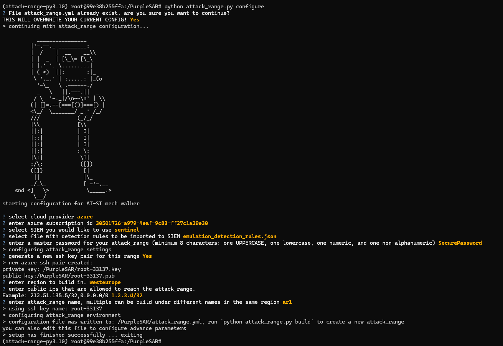

# Deployment guide

## Run Docker container

```bash
docker run -it mihhailsokolov/purplesar-azure
```

## Configure Azure credentials

1. Run `az login`
2. Do the device code authentication workflow
3. Choose relevant subscription

## Configure attack range deployment

```bash
python attack_range.py configure
```



## Start the deployment

```bash
python attack_range.py build
```

## Put `billh` credentials on `ITSERVER`

1. Once the deployment is done, go to Guacamole and login into `DC`
2. RDP into `ITSERVER` - `10.0.1.15` as `billh`
   - Username: `ATTACKRANGE\billh`
   - Password: `PurpleSAR2024!`
3. Disconnect (NOT Sign Out) from the RDP sessions
